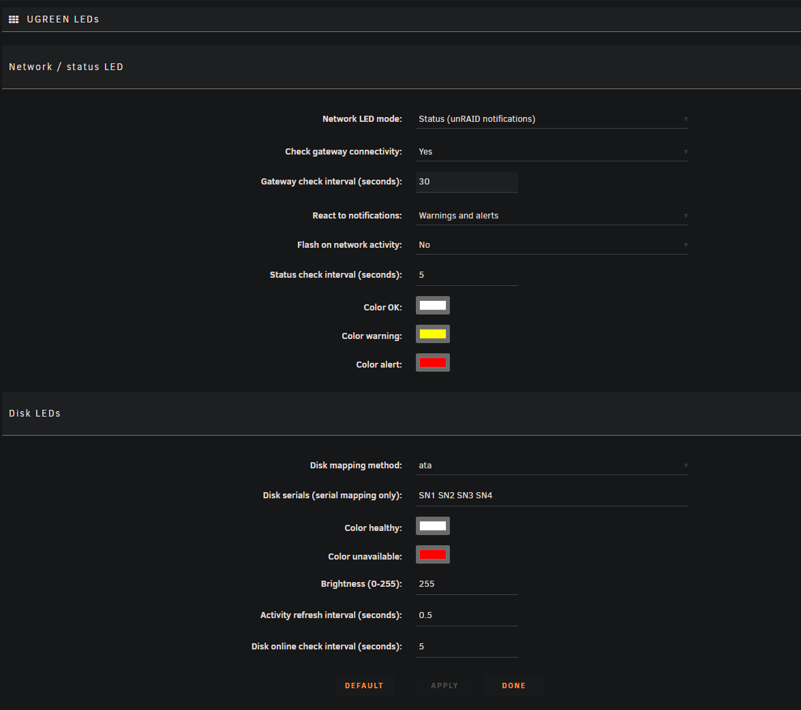

# Unraid UGREEN LED Driver Plugin

> Continuation of [ich777/unraid-ugreenleds-driver](https://github.com/ich777/unraid-ugreenleds-driver) (archived). Adds a status mode for the network LED and a settings page.
>
> **Install:** Plugins > Install Plugin > `https://github.com/RogerSik/unraid-ugreenleds-driver/releases/latest/download/ugreenleds-driver.plg`

This is the repository for the Unraid UGREEN LED Driver plugin based on: https://github.com/miskcoo/ugreen_leds_controller

**Support:** https://github.com/RogerSik/unraid-ugreenleds-driver/issues

## What This Plugin Does

This Unraid plugin adds comprehensive LED control functionality to UGREEN NAS devices, transforming your NAS into a visual monitoring system. It provides:

- **Disk Activity Monitoring**: Individual hard drive activity indicators with LED flashing
- **Network Status Monitoring**: Real-time network connectivity and speed visualization
- **System Health Monitoring**: Disk health and availability status indicators
- **Hardware Compatibility**: Support for multiple UGREEN NAS models

## Supported UGREEN Models

The driver supports these UGREEN NAS models:
- **DXP6800** series (tested on DXP6800 Pro)
- **DX4600** series (tested on DX4600 Pro)
- **DX4700** series
- **DXP2800** series
- **DXP4800** series
- **DXP8800** series (tested on DXP8800 Plus)
- **DXP480T** series (tested on DXP480T Plus) - uses static white LED only

## LED Color Meanings

### Disk LED Colors

| Color | RGB Values | Meaning |
|-------|------------|---------|
| **White** | `255 255 255` | **Healthy disk** - Normal operation (solid) |
| **White** | `255 255 255` | **Disk activity** - Brief flash when I/O detected |
| **Red** | `255 0 0` | **Disk unavailable/offline** - Disk has gone offline or is not accessible (solid) |

### Network LED as status LED (default)

With `NETDEV_MODE="status"` the network LED shows the server state instead of the link speed:

| Color | Setting | Meaning |
|-------|---------|---------|
| **White** | `COLOR_STATUS_OK` | No unread warnings/alerts, gateway reachable |
| **Yellow** | `COLOR_STATUS_WARNING` | Unread unRAID warning notifications |
| **Red** | `COLOR_STATUS_ALERT` | Unread unRAID alerts or gateway unreachable |

Archiving the notifications resets the LED. Configure it under **Settings > User Utilities > UGREEN LEDs**.

### Network LED Colors (`NETDEV_MODE="speed"`)

| Color | RGB Values | Meaning |
|-------|------------|---------|
| **Orange** | `255 165 0` | **Normal network** - Default state when speed is unknown (solid) |
| **Green** | `0 255 0` | **100 Mbps connection** (solid) |
| **Blue** | `0 0 255` | **1 Gbps connection** (solid) |
| **Yellow** | `255 255 0` | **2.5 Gbps connection** (solid) |
| **White** | `255 255 255` | **10 Gbps connection** (solid) |
| **Red** | `255 0 0` | **Gateway unreachable** - Network connectivity issues (solid) |
| **Any Color** | Various | **Network activity** - Flashes on TX/RX activity |

## Monitoring Features

### Disk Monitoring
- **Activity Detection**: LEDs flash briefly (100ms on/off) when disk I/O activity is detected
- **Health Monitoring**: Continuously checks if disks are online every 5 seconds (configurable)
- **Status Indicators**: Solid white = healthy disk, solid red = disk offline/unavailable
- **Slot Mapping**: Maps physical disk slots to LED indicators using ATA, HCTL, or serial number mapping
- **Empty Slot Handling**: LEDs are turned off for disk slots that don't have drives installed

### Network Monitoring
- **Speed Detection**: Automatically detects network interface speed and changes LED color accordingly (solid color)
- **Activity Indicators**: LED flashes on network transmit/receive activity (500ms interval)
- **Gateway Connectivity**: Pings the default gateway every 30 seconds (configurable) to verify connectivity
- **Interface Detection**: Automatically detects the primary network interface from Unraid configuration

### Special Cases
- **DXP480T Model**: Uses a special static white LED configuration instead of dynamic monitoring
- **Model-Specific Mapping**: Different models may use different disk-to-LED mappings (e.g., DXP6800 has custom mapping)

## Configuration Options

The plugin creates a `settings.cfg` file with these configurable parameters. The settings file is stored at: **`/boot/config/plugins/ugreenleds-driver/settings.cfg`**

| Parameter | Default | Description |
|-----------|---------|-------------|
| `MAPPING_METHOD` | `"ata"` | How to map disks to LEDs (ata, hctl, or serial) |
| `DISK_SERIAL` | `"SN1 SN2 SN3 SN4"` | Serial numbers for disk mapping |
| `COLOR_DISK_HEALTH` | `"255 255 255"` | Color for healthy disks (white) |
| `BRIGHTNESS_DISK_LEDS` | `"255"` | LED brightness level |
| `COLOR_DISK_UNAVAIL` | `"255 0 0"` | Color for unavailable disks (red) |
| `LED_REFRESH_INTERVAL` | `"0.5"` | How often to check for disk activity (seconds) |
| `CHECK_DISK_ONLINE_INTERVAL` | `"5"` | How often to check disk online status (seconds) |
| `CHECK_GATEWAY_CONNECTIVITY` | `"true"` | Whether to monitor network connectivity |
| `NETDEV_MODE` | `"status"` | Network LED mode: `status` (notifications) or `speed` (link speed) |
| `NETDEV_BLINK_ACTIVITY` | `"false"` | Status mode: flash on network activity |
| `STATUS_NOTIFY_LEVEL` | `"warning"` | Status mode: `warning` (warnings + alerts), `alert` or `off` |
| `CHECK_STATUS_INTERVAL` | `"5"` | Status mode: how often to check notifications (seconds) |
| `COLOR_STATUS_OK` | `"255 255 255"` | Status mode: everything fine (white) |
| `COLOR_STATUS_WARNING` | `"255 255 0"` | Status mode: unread warnings (yellow) |
| `COLOR_STATUS_ALERT` | `"255 0 0"` | Status mode: unread alerts / gateway unreachable (red) |
| `COLOR_NETDEV_NORMAL` | `"255 165 0"` | Color for normal network (orange) |
| `COLOR_NETDEV_LINK_100` | `"0 255 0"` | Color for 100 Mbps (green) |
| `COLOR_NETDEV_LINK_1000` | `"0 0 255"` | Color for 1 Gbps (blue) |
| `COLOR_NETDEV_LINK_2500` | `"255 255 0"` | Color for 2.5 Gbps (yellow) |
| `COLOR_NETDEV_LINK_10000` | `"255 255 255"` | Color for 10 Gbps (white) |
| `COLOR_NETDEV_GATEWAY_UNREACHABLE` | `"255 0 0"` | Color for gateway issues (red) |
| `CHECK_NETDEV_INTERVAL` | `"30"` | How often to check network status (seconds) |

## Installation

Requirements: unRAID 7.0 or newer on a supported UGREEN NAS (see above).

1. In the unRAID web UI open **Plugins > Install Plugin**
2. Paste this URL and click **Install**:
   ```
   https://github.com/RogerSik/unraid-ugreenleds-driver/releases/latest/download/ugreenleds-driver.plg
   ```
3. Wait for `Installation of UGREEN LED Driver successful`. The plugin downloads the kernel module for your unRAID kernel, detects the model and starts the LEDs right away
4. Configure it under **Settings > User Utilities > UGREEN LEDs**, **Apply** saves and restarts the LED script



**Updates:** every install is pinned to a release. New releases show up under **Plugins > Check for Updates**.

**Coming from ich777's plugin:** install the URL above over it, `settings.cfg` is kept.

**Uninstall:** remove it under **Plugins**, then reboot to unload the kernel module.

## Releasing

1. Add a `###<version>` entry (e.g. `###2026.10.04`) to `<CHANGES>` in `ugreenleds-driver.plg`
2. Merge to `main`, then tag and push: `git tag 2026.10.04 && git push origin 2026.10.04`
3. The `Release plugin` workflow builds the package, fills version and MD5 into the plg and publishes the GitHub release

## Kernel modules

The `Build kernel modules` workflow runs daily: it checks unRAID's release feed (stable + latest next, from 7.3.2 on), downloads the release, takes kernel config and patches from `bzmodules` and builds `led-ugreen` against the matching vanilla kernel (`source/build-kmod.sh`). Each kernel gets its own release (tag = kernel release, e.g. `6.18.38-Unraid`), the notes list the unRAID versions using it. Run it by hand via *Actions > Build kernel modules > Run workflow*, optionally for one unRAID version.

## Troubleshooting

- **LEDs not working**: Check if your model is supported and ensure the kernel module loaded correctly
- **Wrong disk mapping**: Adjust the `MAPPING_METHOD` in settings.cfg
- **Network LED issues**: Verify network interface detection and gateway connectivity
- **Performance issues**: Adjust refresh intervals in the configuration file

## Credits

Based on the excellent work by [miskcoo](https://github.com/miskcoo/ugreen_leds_controller) for the original UGREEN LED controller implementation.